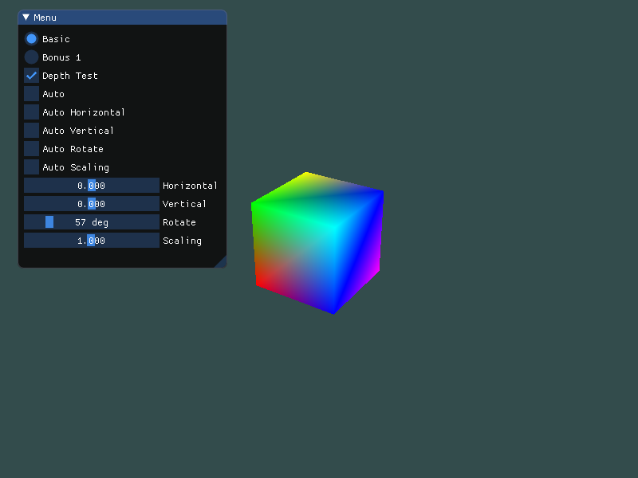
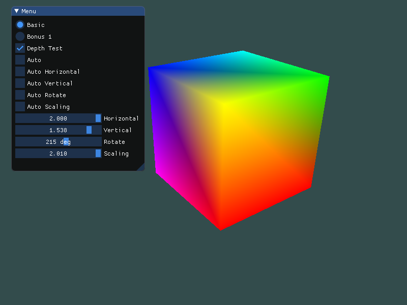
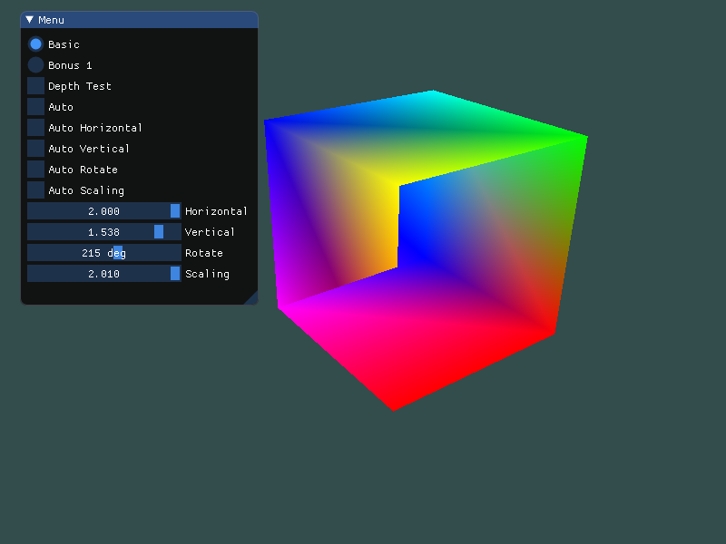
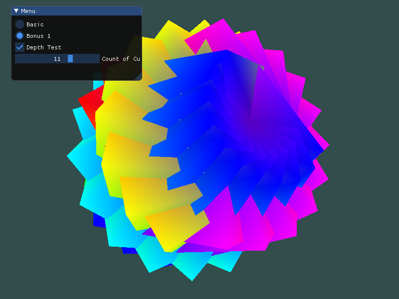

# Hw4 实验报告

## 实验内容

**Basic**:

1. 画一个立方体(cube)：边长为4， 中心位置为(0, 0, 0)。分别启动和关闭深度测试 `glEnable(GL_DEPTH_TEST) `、` glDisable(GL_DEPTH_TEST) `，查看区别，并分析原因。
2. 平移(Translation)：使画好的cube沿着水平或垂直方向来回移动。
3. 旋转(Rotation)：使画好的cube沿着XoZ平面的x=z轴持续旋转。
4. 放缩(Scaling)：使画好的cube持续放大缩小。
5. 在GUI里添加菜单栏，可以选择各种变换。
6. 结合Shader谈谈对渲染管线的理解
    Hint: 可以使用GLFW时间函数 `glfwGetTime()` ，或者 `<math.h>` 、 `<time.h>` 等获取不同的数值

**Bonus**:

1. 将以上三种变换相结合，打开你们的脑洞，实现有创意的动画。比如：地球绕太阳转等。


## 实验过程

> 环境：OpenGL 3.3，GLAD，GLFW，ImGui，glm

首先定义立方体每个点的坐标和颜色，因为每个面都由2个三角形6个点构成，所以需要36个坐标

```cpp
    float vertices[] = {
    -2.0f, -2.0f, -2.0f, 1.0f, 0.0f, 0.0f,
     2.0f, -2.0f, -2.0f, 1.0f, 0.0f, 0.0f,
     2.0f,  2.0f, -2.0f, 1.0f, 1.0f, 0.0f,
     2.0f,  2.0f, -2.0f, 1.0f, 1.0f, 0.0f,
    -2.0f,  2.0f, -2.0f, 0.0f, 1.0f, 0.0f,
    -2.0f, -2.0f, -2.0f, 1.0f, 0.0f, 0.0f,
	...
    };
```


开启/关闭深度测试

```cpp
if (depth) glEnable(GL_DEPTH_TEST);
else glDisable(GL_DEPTH_TEST);
```


旋转一定的角度让立方体显得立体

```cpp
model = glm::rotate(model, 0.5f, glm::vec3(0.5f, 0.0f, 0.0f));
```


而旋转，平移，放缩则只需调用 glm 函数即可

```cpp
model = glm::rotate(model, rotate, glm::vec3(0.0f, 1.0f, 0.0f));
view = glm::translate(view, glm::vec3(trans[0], trans[1], -25.0f));
view = glm::scale(view, glm::vec3(scaling, scaling, scaling)); 
```


最后把变换矩阵传给着色器

```cpp
void Shader::setMat4(const std::string &name, const glm::mat4 &mat) const {
    glUniformMatrix4fv(glGetUniformLocation(ID, name.c_str()), 1, GL_FALSE, &mat[0][0]);
}

shader.setMat4("model", model);
shader.setMat4("view", view);
```


如果选择自动变换，则按照 `glfwGetTime()` 和三角函数进行变换

```cpp
if (auto_all || auto_hor) trans[0] = sin(glfwGetTime()) * 2;    // x 方向平移

if (auto_all || auto_ver) trans[1] = cos(glfwGetTime()) * 2;    // x 方向平移

if (auto_all || auto_scaling) scaling = cos(glfwGetTime()) + 1.01f;    // 缩放倍数

if (auto_all || auto_rotate) rotate = fmod((float)glfwGetTime(), 2 * M_PI);    // 旋转角度
```


**Bonus**：

通过多个立方体的重叠旋转制造出好看的图形

```cpp
void bonus1(const Shader &shader, int nums) {
    glm::mat4 view = glm::mat4(1.0f);
    float radius = 10.0f;
    float camX = sin(glfwGetTime()) * radius;
    float camZ = cos(glfwGetTime()) * radius;
    view = glm::lookAt(glm::vec3(camX, 0.0f, camZ), glm::vec3(0.0f, 0.0f, 0.0f), glm::vec3(0.0f, 1.0f, 0.0f));
    shader.setMat4("view", view);

    // render boxes
    for (unsigned int i = 0; i < nums; ++i) {
        glm::mat4 model = glm::mat4(1.0f);
        model = glm::translate(model, glm::vec3(0.0f, 0.0f, 0.0f));
        float angle = 20.0f * i;
        model = glm::rotate(model, glm::radians(angle), glm::vec3(1.0f, 0.3f, 0.5f));
        shader.setMat4("model", model);

        glDrawArrays(GL_TRIANGLES, 0, 36);
    }
}
```


## 实验结果

具体请看 gif

**Basic**：

可以自由选择手动或是自动，开启/关闭深度测试






关闭深度测试之后




**Bonus**：

拉条可以选择有多少个立方体




## 实验思考

1. 深度测试的区别

   OpenGL是一个三角形一个三角形地来绘制出立方体，所以默认情况下会出现本该被覆盖的三角形覆盖其他三角形的像素。

   而开启了深度测试后，GLFW会自动生成这样一个Z缓冲。深度值存储在每个片段里面（作为片段的**z**值），当片段想要输出它的颜色时，OpenGL会将它的深度值和Z缓冲进行比较，如果当前的片段在其它片段之后，它将会被丢弃，否则将会覆盖。这就是所谓的深度测试。

   开启的方法很简单，只需要 `glEnable(GL_DEPTH_TEST)` 即可，关闭也只需 `glDisable(GL_DEPTH_TEST)`。

   开启之后每一次渲染迭代都需要清空 Z 缓冲，与清空颜色缓冲结合即：

   ```cpp
   glClear(GL_COLOR_BUFFER_BIT | GL_DEPTH_BUFFER_BIT);
   ```

2. 对渲染管线的理解

   OpenGL的图形渲染管线，实际上指的是一堆原始图形数据途经一个输送管道，期间经过各种变化处理最终出现在屏幕的过程。图形渲染管线可以被划分为两个主要部分：第一部分把3D坐标转换为2D坐标，第二部分是把2D坐标转变为实际的有颜色的像素。

   图形渲染管线接受一组3D坐标，然后把它们转变为屏幕上的有色2D像素输出。图形渲染管线可以被划分为几个阶段，每个阶段将会把前一个阶段的输出作为输入。所有这些阶段都是高度专门化的（它们都有一个特定的函数），并且很容易并行执行。正是由于它们具有并行执行的特性，显卡上有成千上万的小处理核心，它们在GPU上为每一个（渲染管线）阶段运行各自的小程序，从而在图形渲染管线中快速处理数据。这些小程序叫做着色器(Shader)。

   由下图可见，渲染管线主要分为**顶点着色器，形状装配，集合着色器，光栅化，片段着色器以及测试与混合。**（具体作用可见 [LearnOpenGL](<https://learnopengl-cn.github.io/01%20Getting%20started/04%20Hello%20Triangle/>)）

   

   现在使用的顶点着色器负责将3D坐标转为另一种3D坐标（投影坐标），同时允许对顶点属性进行一些基本处理。而片段着色器则负责计算一个像素的最终颜色，包含光照，阴影等高级效果。