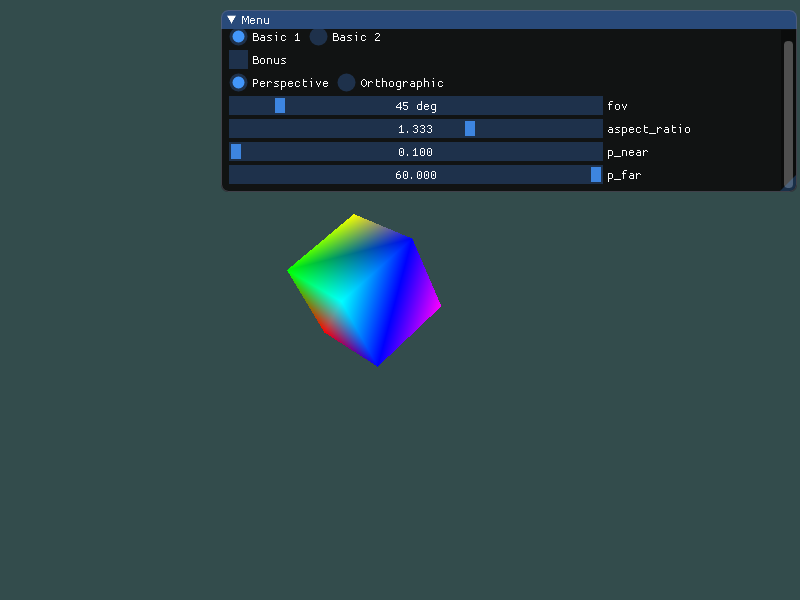

# hw5 实验报告

## 实验内容

**Basic**:

1. 投影(Projection):
    把上次作业绘制的cube放置在(-1.5, 0.5, -1.5)位置，要求6个面颜色不一致

  - 正交投影(orthographic projection)：实现正交投影，使用多组(left, right, bottom, top, near, far)参数，比较结果差异
  - 透视投影(perspective projection)：实现透视投影，使用多组参数，比较结果差异

2. 视角变换(View Changing):
    把cube放置在(0, 0, 0)处，做透视投影，使摄像机围绕cube旋转，并且时刻看着cube中心

3. 在GUI里添加菜单栏，可以选择各种功能。 Hint: 使摄像机一直处于一个圆的位置，可以参考以下公式：

  ```c++
  camPosX=sin(clock()/1000.0)*Radius;
  camPosZ=cos(clock()/1000.0)*Radius;
  ```

  原理很容易理解，由于圆的公式 $a^2+b^2=1$ ，以及有 $\sin(x)^2+\cos(x)^2=1$ ，所以能保证摄像机在XoZ平面的一个圆上。

4. 在现实生活中，我们一般将摄像机摆放的空间View matrix和被拍摄的物体摆设的空间Model matrix分开，但是在OpenGL中却将两个合二为一设为ModelView matrix，通过上面的作业启发，你认为是为什么呢？在报告中写入。（Hints：你可能有不止一个摄像机）

**Bonus**:

1. 实现一个camera类，当键盘输入 w,a,s,d ，能够前后左右移动；当移动鼠标，能够视角移动("lookaround")，即类似FPS(First Person Shooting)的游戏场景

  Hint: camera类的头文件可以参考如下（同样也可以自己定义，只要功能相符即可）：

  ```c++
  class Camera{
  public:
  ...
  void moveForward(GLfloat const distance);
  void moveBack(GLfloat const distance);
  void moveRight(GLfloat const distance);
  void moveLeft(GLfloat const distance);
  ...
  void rotate(GLfloat const pitch, GLfloat const yaw);
  ...
  private:
  ...
  GLfloat pfov,pratio,pnear,pfar;
  GLfloat cameraPosX,cameraPosY,cameraPosZ;
  GLfloat cameraFrontX,cameraFrontY,cameraFrontZ;
  GLfloat cameraRightX,cameraRightY,cameraRightZ;
  GLfloat cameraUpX,cameraUpY,cameraUpZ;
  ...
  };
  ```

  

  PS. void rotate(GLfloat const pitch, GLfloat const yaw) 里的 pitch 、 yaw 均为欧拉角（参考上方
  References）


## 实验过程

### Basic 1

放在 (-1.5, 0.5, -1.5) 只需使用 `glm::translate()` 即可

```cpp
model = glm::translate(model, glm::vec3(-1.5f, 0.5f, -1.5f));
```

正交投影和透视投影根据用户输入决定参数

```cpp
if (p_or_o) {
    // 正交
    projection = glm::ortho(orth[0], orth[1], orth[2], orth[3], orth[4], orth[5]);
} else {
    // 投影
    model = glm::rotate(model, 1.0f, glm::vec3(0.5f, 0.5f, 0.5f)); // 旋转使结果更明显
    projection = glm::perspective(fov, ratio, p_near, p_far);
}
```

最后再传入着色器即可


### basic 2

围绕立方体旋转可以通过使用三角函数计算每一帧的位置：

```cpp
float radius = 20.0f;
float camX = sin(glfwGetTime()) * radius;
float camZ = cos(glfwGetTime()) * radius;
view = glm::lookAt(glm::vec3(camX, 0.0f, camZ), glm::vec3(0.0f, 0.0f, 0.0f), 
                   glm::vec3(0.0f, 1.0f, 0.0f));
```

传入着色器即可


### Bonus

#### 类声明

```cpp
class Camera {
public:
    Camera(glm::vec3 _position = glm::vec3(0.0f, 0.0f, 0.0f));

    glm::mat4 GetViewMatrix();

    void ProcessKeyboard(Camera_Movement direction, float deltaTime);

    void ProcessMouseMovement(float xoffset, float yoffset);

private:
    // Camera Attributes
    glm::vec3 position;
    glm::vec3 front;
    glm::vec3 up;
    glm::vec3 right;
    glm::vec3 worldUp;

    // Euler Angles
    float yaw;
    float pitch;

    // Camera options
    float movementSpeed;
    float mouseSensitivity;

    void updateCameraVectors();
};
```


#### 键盘输入

```cpp
void processInput(GLFWwindow *window) {
    if (glfwGetKey(window, GLFW_KEY_ESCAPE) == GLFW_PRESS)
        glfwSetWindowShouldClose(window, true);

    float velocity = deltaTime * movementSpeed;
    if (glfwGetKey(window, GLFW_KEY_W) == GLFW_PRESS)
        camera.ProcessKeyboard(FORWARD, velocity);
    else if (glfwGetKey(window, GLFW_KEY_S) == GLFW_PRESS)
        camera.ProcessKeyboard(BACKWARD, velocity);
    else if (glfwGetKey(window, GLFW_KEY_A) == GLFW_PRESS)
        camera.ProcessKeyboard(LEFT, velocity);
    else if (glfwGetKey(window, GLFW_KEY_D) == GLFW_PRESS)
        camera.ProcessKeyboard(RIGHT, velocity);
}
```

为了确保不同配置上的移动速度一致，使用`每一帧的时间差 * 速度`作为位移量，然后在 Camera 里处理事件：

```cpp
enum Camera_Movement {
    FORWARD,
    BACKWARD,
    LEFT,
    RIGHT
};

void Camera::ProcessKeyboard(Camera_Movement direction, float velocity) {
    if (direction == FORWARD)
        position += front * velocity;
    if (direction == BACKWARD)
        position -= front * velocity;
    if (direction == LEFT)
        position -= right * velocity;
    if (direction == RIGHT)
        position += right * velocity;
}
```


#### 鼠标移动

首先监听鼠标移动事件：

```cpp
void mouseCallback(GLFWwindow* window, double xpos, double ypos) {
    // first position
    if (firstMouse) {
        lastX = xpos;
        lastY = ypos;
        firstMouse = false;
    }
	
    // caculate offset
    float xoffset = xpos - lastX;
    float yoffset = lastY - ypos;

    lastX = xpos;
    lastY = ypos;

    camera.ProcessMouseMovement(xoffset * mouseSensitivity, yoffset * mouseSensitivity);
}
```

得到 x，y 偏移量后计算 `yaw`，`pitch`：

```cpp
void Camera::ProcessMouseMovement(float xoffset, float yoffset) {
    yaw += xoffset;
    pitch += yoffset;
    pitch = glm::min(89.0f, glm::max(pitch, -89.0f));	// limit the range
    updateCameraVectors();
}
```

最后渲染的时候计算方向向量：

```cpp
void Camera::updateCameraVectors() {
    glm::vec3 f;
    f.x = cos(glm::radians(yaw)) * cos(glm::radians(pitch));
    f.y = sin(glm::radians(pitch));
    f.z = sin(glm::radians(yaw)) * cos(glm::radians(pitch));
    front = glm::normalize(f);
    right = glm::normalize(glm::cross(front, worldUp)); 
    up = glm::normalize(glm::cross(right, front));
}
```

原理：


假设斜边为 1，方向向量为 `front`，那么由图可以看到

$$front.x = \cos(yaw) * \cos(pitch)$$

$$front.y=\sin(pitch)$$

$$front.z=\cos(pitch)*\sin(yaw)$$

之所以是乘，因为图一中 x/z 轴上的边对应的是图二上的边，故而图二中的斜边实际为 $\cos(pitch)$

最后得到 lookat 矩阵：

```cpp
glm::mat4 Camera::GetViewMatrix() {
    return glm::lookAt(position, position + front, up);
}
```


## 实验结果

这里只展示 basic 1，其余请看gif




透视投影正常情况


透视投影：调整四个个参数，因为远近距离过窄，导致立方体被“切”掉了一部分，而视野的变小使立方体显得更大，宽高比的变化改变立方体的形状


正交投影正常情况


正交投影：调整前4个参数后使得立方体被拉长且偏离位置


## 实验思考

**在现实生活中，我们一般将摄像机摆放的空间View matrix和被拍摄的物体摆设的空间Model matrix分开，但是在OpenGL中却将两个合二为一设为ModelView matrix，通过上面的作业启发，你认为是为什么呢？**

View Matrix 是描述摄像机位置的矩阵，而 Model Matrix 是描述物体本身位置的矩阵，OpenGL 将二者合在一起可以直接计算出物体在观察空间中的位置，无需中间计算，减少了运算量，提高性能：

```
#version 330 core
layout (location = 0) in vec3 aPos;
layout (location = 1) in vec3 aColor;

out vec3 ourColor; 

uniform mat4 model;
uniform mat4 view;
uniform mat4 projection;

void main() {
	gl_Position = projection * view * model * vec4(aPos, 1.0f);
    ourColor = aColor;
}
```

传进顶点着色器后，顶点着色器便通过矩阵运算计算出物体的位置。