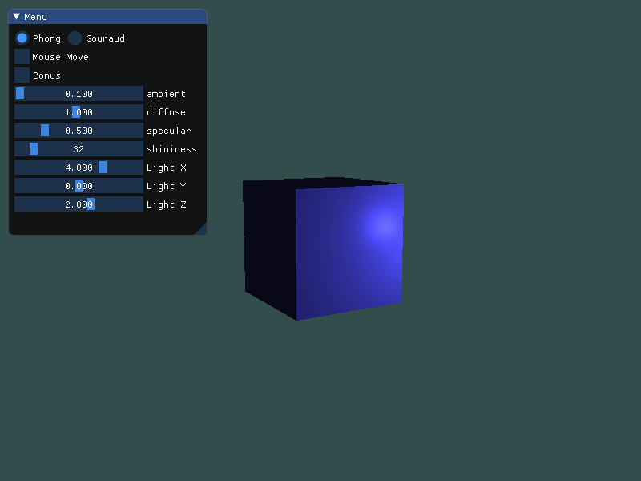
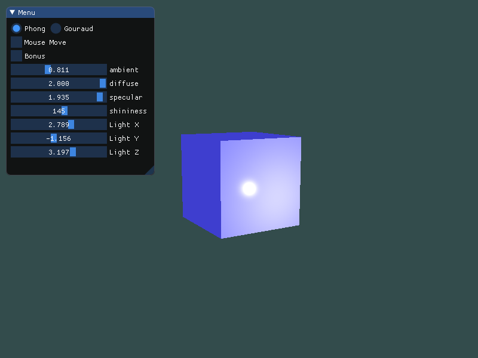
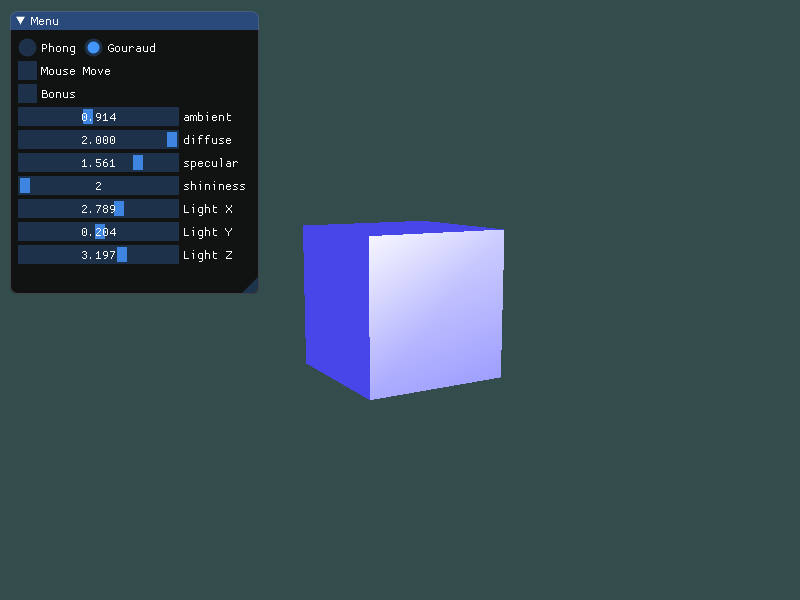

# hw6 实验报告


## 实验内容

**Basic**: 

1. 实现Phong光照模型： 
   
   - 场景中绘制一个cube
   
   - 自己写shader实现两种shading:  Phong Shading 和 Gouraud Shading，并解释两种shading的实现原理
   
   - 合理设置视点、光照位置、光照颜色等参数，使光照效果明显显示 

2. 使用GUI，使参数可调节，效果实时更改： 
   
   - GUI里可以切换两种shading
   
   - 使用如进度条这样的控件，使ambient因子、diffuse因子、specular因子、反光度等参数可调节，光照效 果实时更改 

**Bonus**:

当前光源为静止状态，尝试使光源在场景中来回移动，光照效果实时更改。


## 实验过程

### *Phong Shading*

冯氏光照模型的主要结构由3个分量组成：环境(*Ambient*)、漫反射(*Diffuse*)和镜面(*Specular*)光照：


- 环境光照(*Ambient Lighting*)：即使在黑暗的情况下，世界上通常也仍然有一些光亮（月亮、远处的光），所以物体几乎永远不会是完全黑暗的。为了模拟这个，我们会使用一个环境光照常量，它永远会给物体一些颜色。
- 漫反射光照(*Diffuse Lighting*)：模拟光源对物体的方向性影响(Directional Impact)。它是冯氏光照模型中视觉上最显著的分量。物体的某一部分越是正对着光源，它就会越亮。
- 镜面光照(*Specular Lighting*)：模拟有光泽物体上面出现的亮点。镜面光照的颜色相比于物体的颜色会更倾向于光的颜色。


#### 环境光照

使用一个很小的常量（光照）颜色，添加到物体片段的最终颜色中，这样子的话即便场景中没有直接的光源也能看起来存在有一些发散的光。环境光照只需要用光的颜色乘以一个很小的常量环境因子，即可得到一个环境光照的因子：

```cpp
// fragment shader
// 根据作业要求引入ambient因子
vec3 ambient = ambientStrength * lightColor;
```


#### 漫反射光照

漫反射光照使物体上与光线方向越接近的片段能从光源处获得更多的亮度。这里将法线向量直接作为数据传入着色器中：

```cpp
// vertex shader
layout (location = 0) in vec3 aPos;
layout (location = 1) in vec3 aNormal;

out vec3 FragPos;
out vec3 Normal;

void main() {
    FragPos = vec3(model * vec4(aPos, 1.0));
    // 利用法线矩阵防止不等比缩放后法线
    Normal = mat3(transpose(inverse(model))) * aNormal;  
    
    gl_Position = projection * view * vec4(FragPos, 1.0);
}
```

将世界空间坐标和法向量传入段着色器后：

```cpp
// fragment shader
// 标准化
vec3 norm = normalize(Normal);
vec3 lightDir = normalize(lightPos - FragPos);
// 计算漫反射分量（根据作业要求引入diffuse因子
float diff = max(dot(norm, lightDir), 0.0);
vec3 diffuse = diffStrength * diff * lightColor;
```


#### 镜面光照

使用观察者世界空间位置和片段的位置来计算观察向量，之后，计算镜面光强度，用它乘以光源的颜色：

```cpp
// fragment shader
// 观察者坐标
uniform vec3 viewPos;

void main() {
    // ambient and diffuse
    ...
    
    // specular
    // 计算视线方向向量
    vec3 viewDir = normalize(viewPos - FragPos);
    // 计算反射变量
    vec3 reflectDir = reflect(-lightDir, norm);
    // 计算镜面分量（根据作业要求添加反光度因子
    float spec = pow(max(dot(viewDir, reflectDir), 0.0), shininess);
    // 根据作业要求添加specular因子
    vec3 specular = specularStrength * spec * lightColor;  
	
    // combined
    ...
} 
```


#### 最终颜色

将三种分量结合计算出最终颜色

```cpp
    vec3 result = (ambient + diffuse + specular) * objectColor;
    FragColor = vec4(result, 1.0);
```


###  *Gouraud Shading*

本质上是将计算光照模型的过程放在了顶点着色器中。

- 优势：相比片段来说，顶点要少得多，因此会更高效，所以光照计算频率会更低。
- 劣势：顶点着色器中的最终颜色值是仅仅只是那个顶点的颜色值，片段的颜色值是由插值光照颜色所得来的。结果就是这种光照看起来不会非常真实，除非使用了大量顶点。


由上图可见，*Gouraud Shading* 的亚瑟有明显的颗粒感，因为其是由顶点颜色插值形成的。


### 传入参数

```cpp
lightingShader.setFloat("ambientStrength", ambient);	// ambient 因子
lightingShader.setFloat("diffStrength", diff);          // diffuse 因子
lightingShader.setFloat("specularStrength", specular);  // specular 因子
lightingShader.setInt("shininess", shininess);          // 反光度因子

lightingShader.setVec3("objectColor", glm::vec3(0.3f, 0.3f, 1.0f));  // 物体颜色
lightingShader.setVec3("lightColor", glm::vec3(1.0f, 1.0f, 1.0f));    // 光照颜色
lightingShader.setVec3("lightPos", lightPos);                         // 光源位置
lightingShader.setVec3("viewPos", camera.getPosition());              // 观察者坐标

lightingShader.setMat4("projection", projection);
lightingShader.setMat4("view", view);

glm::mat4 model = glm::mat4(1.0f);
// 旋转调整角度
model = glm::rotate(model, glm::radians(10.0f), glm::vec3(0.5, 0.0, 0.0));
model = glm::rotate(model, glm::radians(30.0f), glm::vec3(0.0, 0.5, 0.0));
lightingShader.setMat4("model", model);
```


### GUI

```cpp
ImGui::RadioButton("Phong", &type, 0);
ImGui::SameLine();
ImGui::RadioButton("Gouraud", &type, 1);
ImGui::Checkbox("Mouse Move", &mouse);

ImGui::Checkbox("Bonus", &bonus);

ImGui::SliderFloat("ambient", &ambient, 0.1f, 2.0f);
ImGui::SliderFloat("diffuse", &diff, 0.1f, 2.0f);
ImGui::SliderFloat("specular", &specular, 0.1f, 2.0f);
ImGui::SliderInt("shininess", &shininess, 2, 256);
```


### Bonus

手动调整光源位置

```cpp
if (!bonus) {
    ImGui::SliderFloat("Light X", &lightPos.x, -10.0, 10.0f);
    ImGui::SliderFloat("Light Y", &lightPos.y, -10.0, 10.0f);
    ImGui::SliderFloat("Light Z", &lightPos.z, -10.0, 10.0f);
}
```


不断调整光源位置

```cpp
lightPos.x = glm::sin(glfwGetTime()) * 6.0;
lightPos.y = glm::cos(glfwGetTime()) * 5.0;
lightPos.z = 2.0f;
```


## 实验结果

详细请看 gif

**初始：**




**调整一些参数后**




**切换到 *Gouraud Shading***

