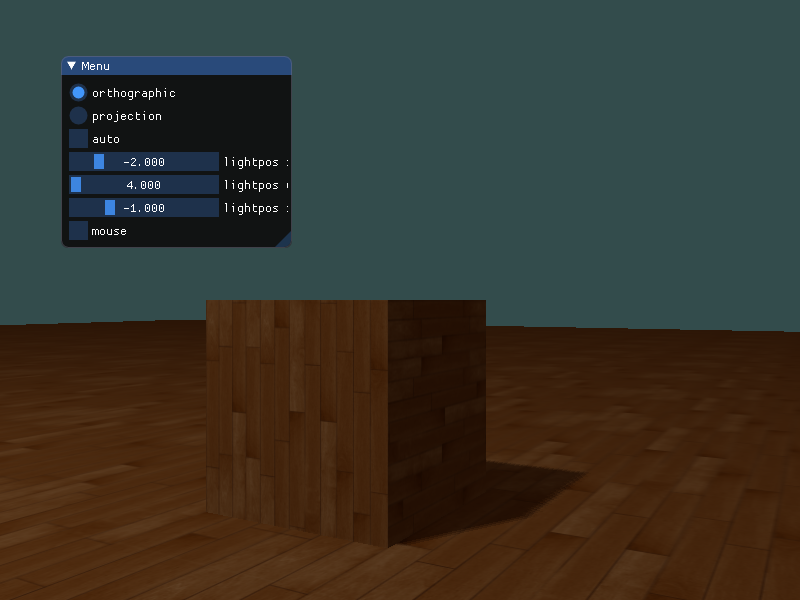
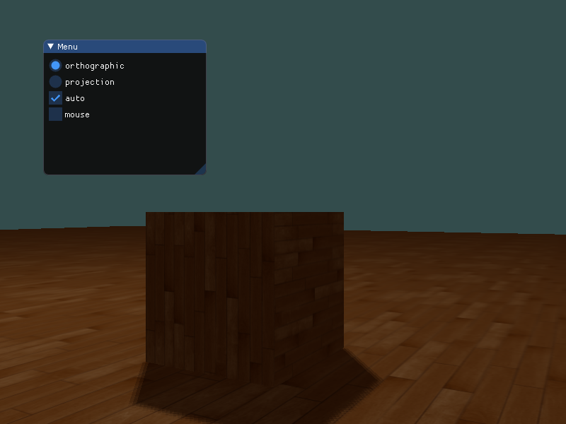
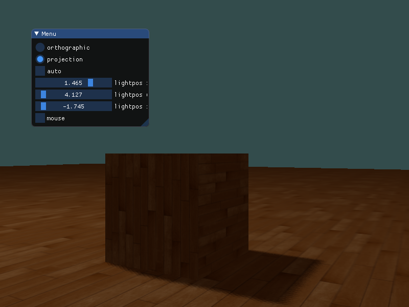

# hw6 实验报告


## 实验内容

Basic:
1. 实现方向光源的Shadowing Mapping:
- 要求场景中至少有一个object和一块平面(用于显示shadow)
- 光源的投影方式任选其一即可
- 在报告里结合代码，解释Shadowing Mapping算法
2. 修改GUI

Bonus:

1. 实现光源在正交/透视两种投影下的Shadowing Mapping
2. 优化Shadowing Mapping (可结合References链接，或其他方法。优化方式越多越好，在报告里说明，有加分)


## 实验过程

### Shadow Mapping


思想很简单：**从光源的位置向物体看去，看不到的地方就一定是阴影**。本质上就是一种*深度测试*，离光源近的片元被保留，离光源远的片元被丢弃。根据这种思想，可以从光源的透视图来渲染场景，并把深度值的结果储存到纹理中，通过这种方式，就能对光源的透视图所见的最近的深度值进行采样。最终，深度值就会显示从光源的透视图下见到的第一个片元。


左侧的图片展示了一个定向光源（所有光线都是平行的）在立方体下的表面投射的阴影。通过储存到深度贴图中的深度值，就能找到最近点，用以决定片元是否在阴影中。

在右侧的图中，首先需要将 $P$ 经过 $T$ 变换变换到光源的坐标空间中，转换之后，$T(P)$ 的深度就是 $P$ 的 $z$ 坐标，通过深度贴图中的深度值可知，$P$ 不是距离光源最近的点，所以在阴影中。


#### 生成深度贴图

第一步需要生成一张深度贴图。深度贴图是从光的透视图里渲染的深度纹理，用它计算阴影。因为需要将场景的渲染结果储存到一个纹理中，所以用帧缓冲：

```cpp
/* const unsigned int SHADOW_WIDTH = 1024, SHADOW_HEIGHT = 1024; */

// create frame buffer object
unsigned int depthMapFBO;
glGenFramebuffers(1, &depthMapFBO);

// create 2D texture
unsigned int depthMap;
glGenTextures(1, &depthMap);
glBindTexture(GL_TEXTURE_2D, depthMap);
glTexImage2D(GL_TEXTURE_2D, 0, GL_DEPTH_COMPONENT, SHADOW_WIDTH, SHADOW_HEIGHT, 0, GL_DEPTH_COMPONENT, GL_FLOAT, NULL);
glTexParameteri(GL_TEXTURE_2D, GL_TEXTURE_MIN_FILTER, GL_NEAREST);
glTexParameteri(GL_TEXTURE_2D, GL_TEXTURE_MAG_FILTER, GL_NEAREST);
glTexParameteri(GL_TEXTURE_2D, GL_TEXTURE_WRAP_S, GL_CLAMP_TO_BORDER);
glTexParameteri(GL_TEXTURE_2D, GL_TEXTURE_WRAP_T, GL_CLAMP_TO_BORDER);

// resolve border problem
float borderColor[] = { 1.0, 1.0, 1.0, 1.0 };
glTexParameterfv(GL_TEXTURE_2D, GL_TEXTURE_BORDER_COLOR, borderColor);

glBindFramebuffer(GL_FRAMEBUFFER, depthMapFBO);
glFramebufferTexture2D(GL_FRAMEBUFFER, GL_DEPTH_ATTACHMENT, GL_TEXTURE_2D, depthMap, 0);
// don't render color 
glDrawBuffer(GL_NONE);
glReadBuffer(GL_NONE);
glBindFramebuffer(GL_FRAMEBUFFER, 0);
```


#### 光源空间的变换

通过透视矩阵和 lookat 矩阵计算出空间变换矩阵。

```cpp
if (type) {
    // projection
    lightProjection = glm::perspective(glm::radians(120.0f), (GLfloat)SHADOW_WIDTH / (GLfloat)SHADOW_HEIGHT, 2.0f, 100.0f);
    lightView = glm::lookAt(lightPos * 1.5f, glm::vec3(0.0f, 1.0f, 0.0f), glm::vec3(0.0f, 1.0f, 0.0f));
    debugDepthQuad.setBool("p_or_o", true);
} else {
    // orthographic
    lightProjection = glm::ortho(-10.0f, 10.0f, -10.0f, 10.0f, near_plane, far_plane);
    lightView = glm::lookAt(lightPos, glm::vec3(0.0f, 1.0f, 0.0f), glm::vec3(0.0f, 1.0f, 0.0f));
    debugDepthQuad.setBool("p_or_o", false);
}

lightSpaceMatrix = lightProjection * lightView; // T
```

顶点着色器也很简单，只要把空间坐标转换即可：

```cpp
#version 330 core
layout (location = 0) in vec3 aPos;

uniform mat4 lightSpaceMatrix;
uniform mat4 model;

void main() {
    gl_Position = lightSpaceMatrix * model * vec4(aPos, 1.0);
}
```

因为深度贴图不需要颜色，所以段着色器为空，只要底层将深度缓冲设置即可。


#### 渲染阴影

使用另外一组着色器来渲染阴影：

```cpp
// vs
#version 330 core
layout (location = 0) in vec3 aPos;
layout (location = 1) in vec3 aNormal;
layout (location = 2) in vec2 aTexCoords;

out vec2 TexCoords;

out VS_OUT {
    vec3 FragPos;
    vec3 Normal;
    vec2 TexCoords;
    vec4 FragPosLightSpace;
} vs_out;

uniform mat4 projection;
uniform mat4 view;
uniform mat4 model;
uniform mat4 lightSpaceMatrix;

void main() {
    vs_out.FragPos = vec3(model * vec4(aPos, 1.0));
    vs_out.Normal = transpose(inverse(mat3(model))) * aNormal;
    vs_out.TexCoords = aTexCoords;
    vs_out.FragPosLightSpace = lightSpaceMatrix * vec4(vs_out.FragPos, 1.0);
    gl_Position = projection * view * model * vec4(aPos, 1.0);
}
```

这里除了光照的部分外，就是把传进的坐标变换成光源空间的坐标，然后在段着色器中计算阴影，段着色器使用*Blinn-Phong 光照模型* 渲染场景。

当片元在阴影中时阴影值是1.0，在阴影外是0.0。然后，diffuse和specular颜色会乘以这个阴影元素。由于阴影不会是全黑的（由于散射），所以这里把 ambient 分量从乘法中剔除：

```cpp
float shadow = ShadowCalculation(fs_in.FragPosLightSpace);                      
vec3 lighting = (ambient + (1.0 - shadow) * (diffuse + specular)) * color;    

FragColor = vec4(lighting, 1.0);
```


#### 阴影计算（改进）

阴影计算：

```cpp
float ShadowCalculation(vec4 fragPosLightSpace) {
    vec3 projCoords = fragPosLightSpace.xyz / fragPosLightSpace.w;
    projCoords = projCoords * 0.5 + 0.5;
    float closestDepth = texture(shadowMap, projCoords.xy).r; 
    float currentDepth = projCoords.z;
    // calculate bias
    vec3 normal = normalize(fs_in.Normal);
    vec3 lightDir = normalize(lightPos - fs_in.FragPos);
    float bias = max(0.05 * (1.0 - dot(normal, lightDir)), 0.005);
    // PCF
    float shadow = 0.0;
    vec2 texelSize = 1.0 / textureSize(shadowMap, 0);
    for(int x = -1; x <= 1; ++x) {
        for(int y = -1; y <= 1; ++y) {
            float pcfDepth = texture(shadowMap, projCoords.xy + vec2(x, y) * texelSize).r; 
            shadow += currentDepth - bias > pcfDepth  ? 1.0 : 0.0;        
        }    
    }
    shadow /= 9.0;
    
    // keep the shadow at 0.0 when outside
    if(projCoords.z > 1.0)
        shadow = 0.0;
        
    return shadow;
}
```

**解释**：

- 将光源空间的坐标转换成裁切空间的标准化设备坐标，不过这一步在使用正交投影时不是必要的，因为 $w$ 保持不变，而透视投影就需要了。

- 将坐标范围变化到 $[0,1]$ 上

- 得到距离光源最近的深度值和当前的深度值

- **改进**：为了解决阴影失真问题，使用阴影偏移。计算偏移量 `bias`

  

- **改进**：为了解决采样过多问题，即平面边缘有阴影，在给边缘设了边缘颜色后，再在着色器中判断超出范围的坐标阴影值设为 0。
- **改进**：为了解决锯齿问题，使用 *PCF*。主要思想是把该像素的八邻域的阴影值进行平均化，使阴影更柔和。还有一种方法是使用 *泊松采样*。


#### 透视/正交

使用透视矩阵时需要将光源放远，视角和远平面也要扩大，才能显示出整个这个阴影。

```cpp
if (type) {
    // perspective
    lightProjection = glm::perspective(glm::radians(120.0f), (GLfloat)SHADOW_WIDTH / (GLfloat)SHADOW_HEIGHT, 2.0f, 100.0f);
    lightView = glm::lookAt(lightPos * 1.5f, glm::vec3(0.0f, 1.0f, 0.0f), glm::vec3(0.0f, 1.0f, 0.0f));
    debugDepthQuad.setBool("p_or_o", true);
} else {
    // orthographic
    lightProjection = glm::ortho(-10.0f, 10.0f, -10.0f, 10.0f, near_plane, far_plane);
    lightView = glm::lookAt(lightPos, glm::vec3(0.0f, 1.0f, 0.0f), glm::vec3(0.0f, 1.0f, 0.0f));
    debugDepthQuad.setBool("p_or_o", false);
}
```


## 实验结果

详情可见 gif

GUI可以选择正交/透视，可以手动/自动调整光源

**正交：**







**透视**




