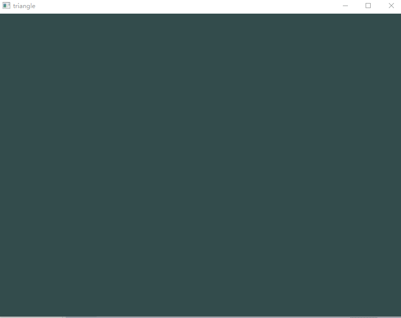

# hw8 实验报告

> 公式来自维基百科

## 实验内容

Basic:
1. 用户能通过左键点击添加Bezier曲线的控制点，右键点击则对当前添加的最后一个控制点进行消除
2. 工具根据鼠标绘制的控制点实时更新Bezier曲线。
Hint: 大家可查询捕捉mouse移动和点击的函数方法

Bonus:

1. 可以动态地呈现Bezier曲线的生成过程。


## 实验过程

### 流程

```cpp
// main
while (!glfwWindowShouldClose(window)) {
    // Clear the screen
    glClearColor(0.2f, 0.3f, 0.3f, 1.0f);
    glClear(GL_COLOR_BUFFER_BIT);

    // process if Esc or display motion track
    processInput(window);

    shader.use();

    // draw points

    if (points.size() > 2) {
        // caculate bezier curve

        if (running) {
            // display motion track
        }
    } else {
        // reset
        running = false;
    }
}
```


### Bezier 曲线

给定点 P0、P1、…、Pn，其贝塞尔曲线为

![$${\mathbf  {B}}(t)=\sum _{{i=0}}^{n}{n \choose i}{\mathbf  {P}}_{i}(1-t)^{{n-i}}t^{i}={n \choose 0}{\mathbf  {P}}_{0}(1-t)^{n}t^{{0}}+{n \choose 1}{\mathbf  {P}}_{1}(1-t)^{{n-1}}t^{{1}}+\cdots +{n \choose n-1}{\mathbf  {P}}_{{n-1}}(1-t)^{{1}}t^{{n-1}}+{n \choose n}{\mathbf  {P}}_{n}(1-t)^{{0}}t^{n}{\mbox{ , }}t\in [0,1]$$](https://wikimedia.org/api/rest_v1/media/math/render/svg/c927f56552e184c4debebc83a08dc79896052a14)

用代码实现：

```cpp
// Binomial coefficient C(n,K)
int binom(int n, int k) {
    if (k * 2 > n) k = n - k;
    if (k == 0) return 1;

    int result = n;
    for (int i = 2; i <= k; ++i) {
        result *= (n - i + 1);
        result /= i;
    }
    return result;
}

// B(t)
glm::vec2 bezier(double t) {
    int order = points.size() - 1;

    double y = 0;
    double x = 0;

    double p1 = glm::pow(1 - t, order);
    double p2 = 1;

    for (int i = 0; i <= order; i++) {
        x += binom(order, i) * p1 * p2 * points[i].x;
        y += binom(order, i) * p1 * p2 * points[i].y;
        p1 /= 1 - t;
        p2 *= t;
    }

    return glm::vec2(x, y);
}
```


### 鼠标输入

```cpp
void mouseCallback(GLFWwindow* window, int button, int action, int mods) {
    // stop when running animation
    if (running) return;

    if (button == GLFW_MOUSE_BUTTON_LEFT && action == GLFW_PRESS) {
        //getting cursor position
        double xpos, ypos;
        glfwGetCursorPos(window, &xpos, &ypos);

        // normalize
        points.push_back(glm::vec2((float(xpos) / float(WIDTH) * 2.0f) - 1, -((float(ypos) / float(HEIGHT) * 2.0f) - 1)));
    } else if (button == GLFW_MOUSE_BUTTON_RIGHT && action == GLFW_PRESS) {
        points.pop_back();
    }
}

```


### Bonus

使用 **德卡斯特里奥算法**（*De Casteljau's algorithm*）:

贝兹曲线 *B*（角度为 *n*，控制点）可用以下方式运用德卡斯特里奥算法


其中 *b* 为 *伯恩施坦基本多项式*


曲线在  点上可以用递推关系式运算


然后，  在  点上的计算可以此算法的  步计算。 的结果为：


用代码实现即为：

```cpp
if (running) {
    // use loop instead of recursive
    std::vector<glm::vec2> nodes(points);
    while (nodes.size() > 1) {
        std::vector<glm::vec2> next;
        for (int i = 1; i < nodes.size(); ++i) {
            // draw line
            float raw_p[]{
                nodes[i - 1].x, nodes[i - 1].y, 0.0f, 1.0f, 1.0f, 0.0f,
                nodes[i].x,     nodes[i].y,     0.0f, 1.0f, 1.0f, 0.0f
            };

            glBufferData(GL_ARRAY_BUFFER, 12 * sizeof(float), raw_p, GL_STATIC_DRAW);
            glDrawArrays(GL_LINES, 0, 2);

            // cacluate next level
            glm::vec2 nextPoint;
            nextPoint.x = nodes[i].x * running_t + nodes[i - 1].x * (1 - running_t);
            nextPoint.y = nodes[i].y * running_t + nodes[i - 1].y * (1 - running_t);
            next.push_back(nextPoint);
        }
        nodes = next;
    }

    running_t += 0.01;
    if (running_t >= 1.0f)
        running = false;
}
```


## 实验结果

左键增加点，右键删除最近增加的点，空格展示计算轨迹



